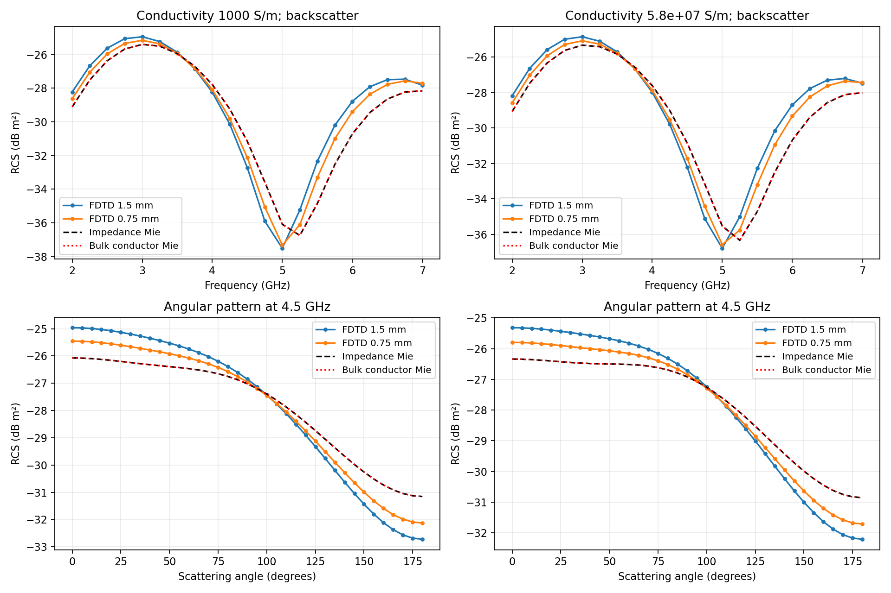
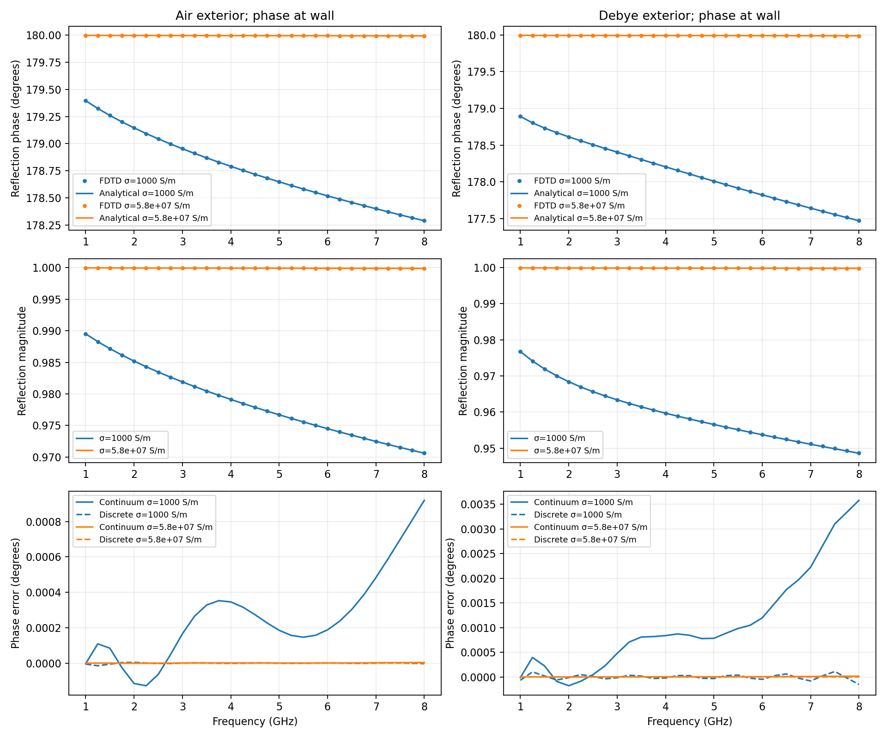

# Analytical surface-impedance validations

Recorded 2026-09-07 with the local gprMax environment, CPU double precision,
four OpenMP threads. Both drivers pass their acceptance criteria. The
retained CSV files contain the complex quantities, so phase and magnitude
comparisons can be reproduced without rerunning FDTD.

## Conducting spheres

A 16 mm radius sphere in air is illuminated by a Ricker pulse centred at
4.5 GHz. A vector discrete plane wave supplies the closed TFSF excitation;
a closed equivalent-current NTFF surface measures the scattered field.
The 96 mm cubic domain has eight PML cells on each side and a 4 ns record.
The TFSF box spans 24–72 mm and the NTFF box 18–78 mm, both centred on the
sphere at (48, 48, 48) mm. The sphere is an opaque SIBC volume, with no
cells through the skin depth.

The reference uses the engineering time convention `exp(+jωt)` and outgoing
spherical Hankel functions of the second kind. With `x=ka`, `ζ=Zs/η0`,
`ψn=x jn(x)` and `ξn=x hn^(2)(x)`, the coefficients are

```text
an = (ψn' − j ζ ψn) / (ξn' − j ζ ξn)
bn = (ψn + j ζ ψn') / (ξn + j ζ ξn')
Zs = (1+j) sqrt(π f μ0 / σ)
```

These implement the impedance-boundary Mie construction described by
[Sihvola et al., Physical Review B 98, 235417 (2018)](https://doi.org/10.1103/PhysRevB.98.235417).
A second reference uses the full homogeneous sphere with
`εr=1−jσ/(ωε0)`, including displacement current. Its internal logarithmic
Bessel derivative uses the [DLMF recurrence](https://dlmf.nist.gov/10.51)
and [exponentially scaled Bessel functions](https://docs.scipy.org/doc/scipy/reference/generated/scipy.special.jve.html).
This avoids overflow at copper conductivity. Tests cross-check it against
the existing unscaled dielectric reference, verify the complex PEC limit,
and check positive absorption for passive surface impedance.

The CSV files cover 21 frequencies from 2 to 7 GHz and the equatorial
angular cut from 0° to 180° at 5° spacing, for incident Ez and propagation
along +x. Complex amplitudes are normalized by the incident electric DFT
at the sphere centre. Errors use the analytic impedance with the physical
good-conductor formula; the fit error and bulk-Mie discrepancy are separate.

| Conductivity (S/m) | Grid (mm) | Backscatter RMS (dB) | Maximum error (dB) | Complex pattern relative L2 |
|---:|---:|---:|---:|---:|
| 1,000 | 1.5 | 1.30447 | 2.51283 | 12.5938% |
| 1,000 | 0.75 | 0.85464 | 1.54738 | 7.2025% |
| 58,000,000 | 1.5 | 1.25862 | 2.43024 | 11.8483% |
| 58,000,000 | 0.75 | 0.83204 | 1.54577 | 6.6818% |

The fine-mesh gates are 1 dB RMS, 2 dB maximum, and 15% complex-pattern
relative L2. Refinement must reduce both RMS backscatter and complex-pattern
errors. The coarse meshes do not meet the fine-mesh gates and are retained
as convergence evidence. Staircasing shifts the backscatter minimum and
limits accuracy, especially near the minimum.

The maximum impedance fit error on the analysis frequencies is 0.11627%
(gate 0.2%), using the 1–10 GHz fit band. Impedance and full bulk Mie complex
amplitudes differ by relative L2 `9.238e-6` at 1,000 S/m and `6.678e-13` at
58,000,000 S/m (gate 2%). At the lowest frequency, skin depth is only 2.22%
of the radius even for the less conductive sphere. Copper scattering is
nearly PEC; this test alone cannot establish the accuracy of its very small
finite-conductivity correction. The phase experiment below resolves that
correction in a flat geometry.



[Machine-readable sphere results](results/conductor_sphere/summary.json).

## Reflected plane-wave phase

A transverse uniform Ez current sheet launches a TEM wave, using PMC y
faces and PEC z faces. A matching no-wall run supplies the incident trace.
The source, receiver and metal wall lie at x=0.80, 0.86 and 0.89 m. The
domain is 1.8 m long and four cells wide in each transverse direction;
the metal occupies 4 mm along x. The earliest outer-boundary return is
5.537 ns, beyond the 4 ns record. No PML accuracy is assumed in this test.

Both conductivities above are tested in air and in a Debye exterior with
`εr(ω)=2.5+2/(1+jω·80 ps)`. The dispersive material directly touches the
SIBC, including its retained half dual cells. The 4 GHz Ricker pulse is
analysed at 29 frequencies spanning 1–8 GHz. The passive surface fit uses
0.5–12 GHz, selecting eight poles with maximum fit error 0.016483%.

The continuum wall coefficient is `Γ=(Zs−η)/(Zs+η)` with
`η=sqrt(μ0/(ε0 εr))`. The measured ratio is
`(Etotal−Eincident)/Eincident`, de-embedded by `exp(+2jk d)`, with
`d=30 mm` and the independently derived discrete host wavenumber. Thus the
reported continuum error measures wall accuracy after removing known grid
propagation error; it is not the uncorrected phase error at the receiver.

The independent discrete comparison evaluates the Debye recurrence from
its physical parameters and the fitted surface at the bilinear-warped
frequency. With `θ=ωdt`, `Ω=2sin(θ/2)/dt`, and the recurrence's `εalg`,

```text
k = 2 asin(Δx Ω sqrt(εalg) / (2c)) / Δx
ηalg = η0 / sqrt(εalg)
Zalg = Zfit(tan(ωdt/2)/(πdt))
Γdiscrete = [Zalg cos(kΔx/2) − ηalg cos(θ/2)]
            / [Zalg cos(kΔx/2) + ηalg cos(θ/2)]
```

The half-cell Ampere mass cancels the sine term of the staggered H samples.
Tests verify that this expression satisfies the half-cell equation and
converges quadratically to the continuum coefficient.

| Exterior | Conductivity (S/m) | Grid (mm) | Continuum phase RMS (degrees) | Discrete phase RMS (degrees) |
|---|---:|---:|---:|---:|
| Air | 1,000 | 1 | 0.00146789 | 0.00000344 |
| Air | 1,000 | 0.5 | 0.00035899 | 0.00000346 |
| Air | 58,000,000 | 1 | 0.00000609 | 0.00000002 |
| Air | 58,000,000 | 0.5 | 0.00000149 | 0.00000001 |
| Debye | 1,000 | 1 | 0.00612378 | 0.00005387 |
| Debye | 1,000 | 0.5 | 0.00149638 | 0.00005359 |
| Debye | 58,000,000 | 1 | 0.00002537 | 0.00000022 |
| Debye | 58,000,000 | 0.5 | 0.00000620 | 0.00000021 |

Every case passes: continuum phase RMS ≤0.1°, magnitude RMS ≤0.002,
discrete phase RMS ≤0.0002°, and discrete complex relative L2 ≤1e-5.
The maximum magnitude RMS error is 0.0002164 on the coarse mesh and
0.00005252 on the fine mesh. The discrete complex relative L2 is at most
`1.322e-6`. All analysed frequencies have incident amplitude above 15% of
the band maximum (gate 0.1%); final-tenth pulse amplitude is below `1e-6`
of the peak (gate `1e-5`). Transverse receiver traces agree exactly.

The regression suite also performs a negative control: intentionally
removing `Re(c P)` from the boundary update produces 0.001994° discrete
phase RMS error for the 1 mm Debye/1,000 S/m case. This fails the phase gate,
whereas the complete polarization update passes at 0.00005387°. The gate
therefore detects missing polarization history even when a looser continuum
comparison would still pass.



[Machine-readable reflection results](results/reflection_phase/summary.json).

## Reproduction and scope

```console
python -m testing.validation.impedance_surface.validate_conductor_sphere --threads 4
python -m testing.validation.impedance_surface.validate_reflection_phase --threads 4
python -m pytest tests/impedance_surfaces/test_analytical_validation.py
```

Append `--reuse` to regenerate CSV, PNG and JSON from compatible local
caches. Both validation drivers return a nonzero status when a gate fails.
Elapsed times in reused-case summaries measure reanalysis, not simulation
performance; use the separate benchmarking drivers for timing.

The completed regression run passed 483 tests across
`tests/impedance_surfaces`, `tests/ntff/test_mie_reference.py`, and
`tests/test_eigenmode_numerical_dispersion.py`, including 20 new analytical
reference and polarization negative-control checks.

These results cover staircased spheres in air and normal-incidence planar
reflection in air or a single-Debye exterior. They do not establish accuracy
for arbitrary curved surfaces touching dispersive media, oblique incidence,
or every multipole material. Existing kernel and symmetry regressions cover
additional Debye, Lorentz, Drude and mixed-material contacts.
