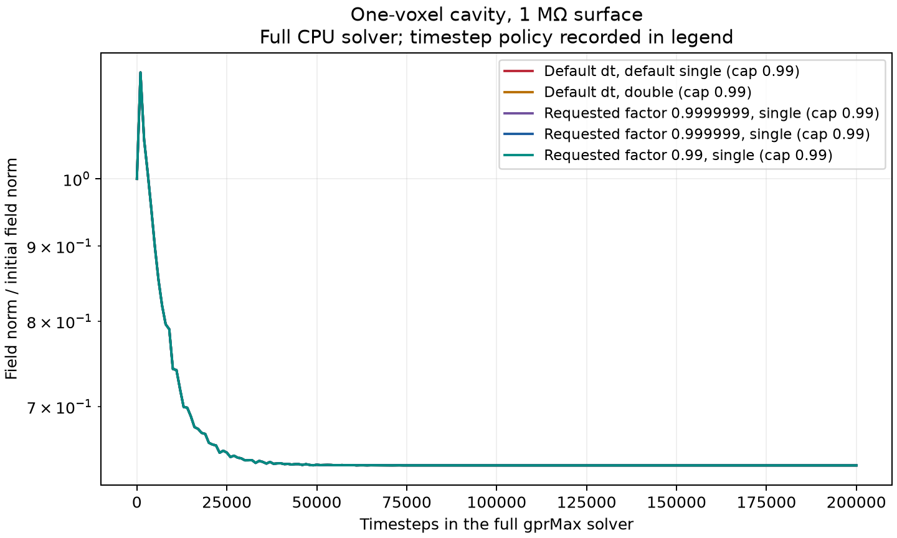
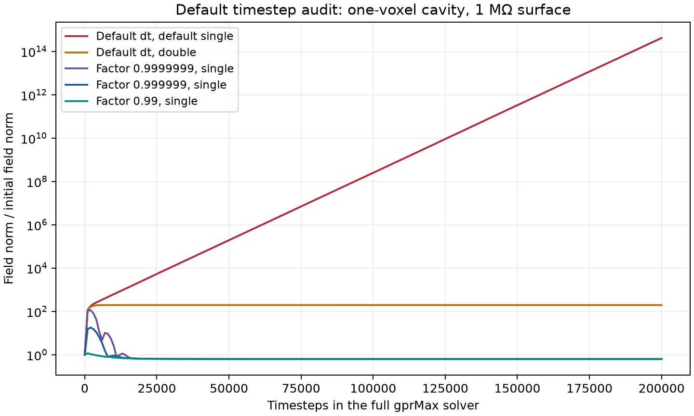

# Default gprMax CFL and stability follow-up

11 September 2026. Source checkout `977780ce`; the timestep routine matches
`upstream/devel`. This follow-up checks the manager's observation about
representability and downward timestep rounding.

**Current implementation:** declaring SIBC now applies the existing
`TimeStepStabilityFactor` command with a maximum factor of **0.99**, preserving
smaller user factors and logging automatic reductions. The scalar upstream
CFL calculation is unchanged. The endpoint measurements below describe the
historical behavior before this protection; use `--historical` to reproduce
them with the validation-only bypass.

## Verification of the automatic margin

The full solver was rerun for **200,000 steps per case** with the automatic
policy enabled. No timestep or precision command was supplied for the
default cases. At 1 mm, the resulting timestep is
`1.906574869531005e-12 s`, or `0.98999999999999957` of the c-based CFL limit.

| Geometry / surface | CPU precision | Peak norm ratio | Result |
| --- | --- | ---: | --- |
| Cavity, 1 MΩ | Default single | **1.428** | Bounded; final ratio 0.639 |
| Cavity, 1 MΩ | Double | 1.428 | Bounded |
| Cavity, 50 Ω | Default single | 1.000 | Bounded |
| Cavity, copper ADE | Default single | 1.091 | Bounded |
| Staircase, 1 MΩ | Default single | 1.323 | Bounded |
| Staircase, copper ADE | Default single | 1.259 | Bounded |

The three additional runs requesting `0.9999999`, `0.999999`, and `0.99`
all used an effective factor of `0.99` and reproduced the 1.428 cavity peak.
The coefficient-derived effective Courant number is `0.99000003449`, safely
below one for this case. The norms and sampling convention are defined below.

[Protected raw results](results/default_cfl_protected.json) retain all nine
runs and coefficient checks. These finite-duration tests address the observed
failure; they are not a general stability proof for every coupled model.



## Historical CFL endpoint finding

**The manager's point is correct for the 1 mm test mesh: the stored default
timestep is below the mathematical CFL limit. The high-resistance cavity
still grows because its single-precision update coefficients put the coupled
recurrence slightly above its stability limit.** This is now explained by
the stored coefficients and reproduced with the complete gprMax solver.

## What the upstream scalar timestep calculation does

`FDTDGrid.calculate_dt()` in `gprMax/grid/fdtd_grid.py` calculates

```python
dt = 1 / (c * sqrt(1/dx**2 + 1/dy**2 + 1/dz**2))
dt = round_value(dt, decimalplaces=decimal.getcontext().prec - 1)
```

`round_value()` calls `round_float()`, which converts to `Decimal`, applies
`ROUND_FLOOR`, then converts back to a binary64 float. In this environment
the Decimal context precision is 28, so the quantization is to **27 decimal
places**, i.e. an absolute increment of `1e-27` seconds. This is not the same
operation as always subtracting one binary floating-point ULP.

The timestep remains binary64. The default CPU precision in both this branch
and the fetched upstream development source is **single**, so field arrays
and stored update coefficients are float32.

For the 1 mm cubic mesh, an 80-digit calculation using the exact stored
binary grid spacings and `c` gives:

| Quantity | Value |
| --- | --- |
| High-precision CFL | `1.92583320154647044699058296656e-12 s` |
| Raw binary64 evaluation | `1.9258332015464706e-12 s` |
| Actual default dt | `1.92583320154647e-12 s` |
| Raw binary64 bits | `0x1.0f0974194a50fp-39` |
| Default binary64 bits | `0x1.0f0974194a50dp-39` |
| Downward adjustment | **2 binary64 ULPs** |
| Actual dt / mathematical CFL | **`0.9999999999999996669861...`** |
| Relative margin below CFL | **`3.33013873e-16`** |

So the 1 mm instability is not caused by omitting gprMax's rounding, or by
replacing its timestep with an exact mathematical CFL value.

The earlier report's approximately `6e-13` energy-operator margin included a
different effect. The stored SciPy constants satisfy

```text
c² * epsilon0 * mu0 = 1.000000000001193538879...
```

The ratio to the CFL calculated from `1/sqrt(epsilon0*mu0)` is consequently
`0.99999999999940289755...`. Most of that margin is the small mismatch between
stored constants, not the two-ULP rounding of `dt`.

## Stored coefficients identify the failure

The new audit constructs the isolated cavity's 18-variable map directly from
the stored coefficients: 12 electric edges and 6 magnetic faces. Each stored
float32 value is promoted to double **before** algebra. This avoids the
roundoff introduced by the previous basis-field probes.

Writing the actual resistive recurrence as

\[
h'=h+Qe,\qquad e'=a e+Rh',
\]

the amplification matrix is

\[
A=\begin{bmatrix}aI+RQ&R\\Q&I\end{bmatrix}.
\]

For a spatial eigenmode with `kappa = eigenvalue(-RQ)`, its roots satisfy

\[
z^2-(1+a-\kappa)z+a=0.
\]

Here `0 < a < 1`. The high-frequency root crosses `-1` when
`kappa > 2*(1+a)`. Define the effective Courant factor for this cavity mode as
`sqrt(kappa_max / (2*(1+a)))`; this includes the midpoint resistive load.
It is a diagnostic of the coupled coefficients, not a replacement definition
of the scalar timestep ratio.

For the 1 MΩ cavity with **unmodified default dt and CPU precision**:

| Coefficient diagnostic | Value |
| --- | ---: |
| Electric retention `a` | 0.9991303169531207 |
| Maximum stiffness `kappa` | 3.998260779234654 |
| Stability ceiling `2*(1+a)` | 3.9982606339062414 |
| Relative stiffness excess | **3.63479087e-8** |
| Effective Courant factor | **1.0000000181739541** |
| Predicted spectral radius | **1.000143463252383** |
| Measured late-time growth per step | **1.0001433898740324** |

The predicted and measured growth agree closely. The prediction is the
real-arithmetic map of the rounded coefficients; the small remaining
difference includes arithmetic rounding during execution. It is no longer
necessary to infer the cause solely from a long-time trace.

Moving the scalar factor from 1 to `nextafter(1,0)` leaves this float32
coefficient map unchanged. Even a factor of `0.99999999` gives the same
reported coefficients and growth rate in this case. A binary64-sized margin
does not necessarily survive float32 coefficient storage.

## Historical full-solver experiments

These tests call **`gprMax.run()` and the complete production `Solver.solve()`**.
For default cases they omit both `TimeStepStabilityFactor` and
`cpu_precision`; reproduction now bypasses only the automatic SIBC policy.
`FDTDGrid.calculate_dt()` and the update methods are not patched.
An observation wrapper supplies fixed-seed initial fields after
normal solver construction and records their norms through the solver's
iteration iterator. The fields then evolve through every normal solver
stage. PML is explicitly disabled and one OpenMP thread is used to isolate
the surface coupling.

All entries below ran **200,000 timesteps**. The cavity is one retained voxel
inside a 3 × 3 × 3 impedance shell in a 5 × 5 × 5 PEC box. Random initial
fields excite the high-frequency modes; a zero-initialized, source-free
simulation would stay identically zero and would not test stability.

| Geometry / surface | Timestep / precision | Peak norm ratio | Result |
| --- | --- | ---: | --- |
| Cavity, 1 MΩ | Both defaults | **4.23e14** | Exponential growth |
| Cavity, 1 MΩ | Default dt, double | 197.89 | Bounded, large amplification |
| Cavity, 50 Ω | Both defaults | 1.00 | Bounded |
| Cavity, copper ADE | Both defaults | 1.11* | Bounded |
| Staircase, 1 MΩ | Both defaults | 1.34 | Bounded |
| Staircase, copper ADE | Both defaults | 1.27* | Bounded |
| Cavity, 1 MΩ | Factor 0.9999999, single | 119.91 | No sustained growth; final ratio 0.64 |
| Cavity, 1 MΩ | Factor 0.999999, single | 49.35 | No sustained growth; final ratio 0.64 |
| Cavity, 1 MΩ | Factor 0.99, single | 1.43 | Bounded with much smaller amplification |

Norms use `(E, eta0 H)`, normalized by the initial norm after storage in the
actual field dtype. *For copper, the state norm also includes its surface
`y` histories; this is not a physical energy norm. Peaks are sampled every
20 timesteps. Static modes explain residual field norms.



Thus **0.99 is not the minimum factor needed to stop this specific
exponential growth**. A reduction of `1e-7` was enough here, but the nearly
critical modes still showed roughly 120-fold amplification. The larger
0.99 margin gives much better conditioning. These case-specific thresholds
are not universal safety factors for every mesh, coefficient set, or device.

## Is the scalar rounding always below mathematical CFL?

A separate sweep calls the actual default timestep function at nine cubic
mesh scales and compares against an 80-digit reference. Because the code
floors at an absolute decimal scale and then converts back to binary64, its
final result is not universally a directed binary rounding below the exact
formula. For example, on this platform:

| Cell size | Downward binary64 ULPs | Relative margin below c-based CFL |
| --- | ---: | ---: |
| 1 µm | 1193 | +2.44e-13 |
| 1 mm | 2 | +3.33e-16 |
| 2 mm | 0 | **−8.64e-17** |
| 10 mm | 0 | +3.94e-17 |

The 2 mm negative margin means a tiny scalar overshoot of the exact c-based
formula. It is separate from the 1 mm coefficient failure: the 1 mm scalar
timestep is below its limit, and the stored epsilon/mu constants still give
a positive mass-based margin in these scalar examples. A scalar-only
`nextafter` adjustment would not resolve the observed float32 coefficient
overshoot. The scalar rounding is unchanged; the new SIBC policy applies its
0.99 cap through the existing timestep command before coefficients are built.

## Reproduction and scope

```text
python -m testing.validation.impedance_surface.default_cfl --steps 200000
python -m testing.validation.impedance_surface.default_cfl --historical --steps 200000
python -m pytest tests/impedance_surfaces/test_default_cfl.py tests/impedance_surfaces/test_clipped_stability.py -q
```

The [historical raw JSON](results/default_cfl.json) contains all nine full-solver runs,
nine coefficient-factor checks, nine mesh-scale rounding checks, constants,
hexadecimal timesteps, 80-digit comparisons, and norm traces. Running without
`--historical` writes separate `default_cfl_protected.json` and `.png` files.
Tests cover the protected default, preserved stricter settings, both input
forms, time-window/metadata/ADE consistency, and the historical failure.
The known-unstable reproducer test checks that its diagnostic predicts and
reproduces growth with the cap disabled; it does not run the protected default.

The finding concerns the supported resistive-surface cavity under the
current CPU float32 coefficient storage. It does not establish an extra
geometric CFL penalty from clipping, nor a general instability of practical
copper surfaces. Other backends, material dispersions, and larger physical
scenes need their own checks.
