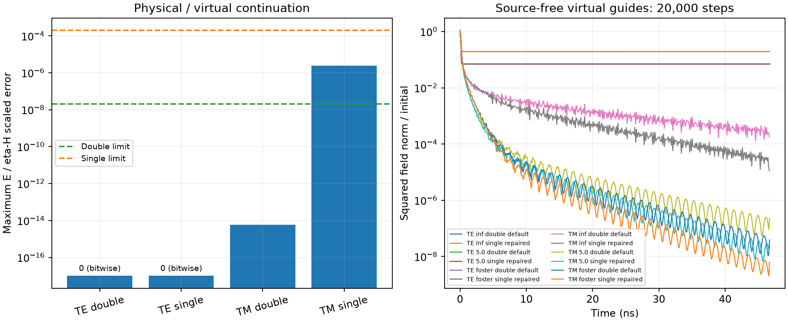

# Full 2D SIBC and virtual-guide validation

CPU kernels; 1 mm physical cells; automatic timestep factor 0.99. The long-run timestep is 2.335067793382187 ps (46.7014 ns for 20,000 steps).

- 36 reduced/3D comparisons, including corners and fitted surface states.
- 288 physical/virtual comparisons: TE/TM, every invariant/propagation axis, both directions and precisions, passive and active, PMC / 5 ohm / four-pole fitted surfaces.
- 12 source-free 20,000-step guide runs with default and repaired HORIPML.

## Measured field agreement

| Case | Maximum relative error |
|---|---:|
| TE double | 0 |
| TE single | 0 |
| TM double | 6.00652e-15 |
| TM single | 2.41208e-06 |
| Reduced / 3D, double | 3.33994e-14 |
| Reduced / 3D, single | 6.31428e-07 |

Field differences use a common maximum of |E| and eta0 |H|. This keeps analytically zero TEM components from being normalized by their own roundoff noise.
The separate 3D reference uses the full 3D field kernels and compiler, with two owned invariant layers and periodic image closure on its outer storage planes. This isolates the reduced stencil from the native PML's half-open transverse outer face.

## Long-time bounds and reflection

Norm and history bounds are sampled every 50 steps and at the final step.

| Mode / surface / profile | Peak sampled squared norm | Final squared norm |
|---|---:|---:|
| TE / inf / default | 0.862624 | 0.194034 |
| TE / inf / repaired | 0.862624 | 0.194056 |
| TE / 5.0 / default | 0.860299 | 0.0705248 |
| TE / 5.0 / repaired | 0.860299 | 0.0705254 |
| TE / foster / default | 0.860302 | 0.0705241 |
| TE / foster / repaired | 0.860302 | 0.0705242 |
| TM / inf / default | 1.11605 | 0.000174524 |
| TM / inf / repaired | 1.11605 | 1.12355e-05 |
| TM / 5.0 / default | 0.852131 | 2.32401e-07 |
| TM / 5.0 / repaired | 0.852131 | 2.23509e-08 |
| TM / foster / default | 0.852415 | 3.86195e-08 |
| TM / foster / repaired | 0.852415 | 6.2424e-09 |

Peak differences against the longer causal reference range from 0.000471026 to 0.00479164 for these eight-cell PMLs. They measure finite-absorber reflection, separately from aperture coupling.

All reported long runs remain bounded with finite field, PML, and ADE histories. The TE packet has nonzero initial electric divergence and retains stationary charge fields; its late norm need not decay to zero. The JSON and CSV files retain late fitted slopes and history maxima; slopes at a stationary or roundoff floor are not an exponential-growth diagnosis.



## Reproduce

```text
python -m testing.validation.impedance_surface.validate_2d
python -m pytest tests/impedance_surfaces/test_2d_sibc.py -q
```

The broader test selection and environment limitations are recorded in [regression checks](regression_checks.md).

The repaired profile uses alpha1=0, unit kappa, and alpha2(z)=1.1*sigma1(z) with matching quartic grading. Default profiles use double precision and repaired long runs use single precision; the full coupling matrix checks both precisions for every surface.

Scope: CPU main-grid TE/TM and 3D; passive walls, uniform longitudinal PML continuation, isotropic lossless nondispersive retained hosts in PML and virtual guides. These tests do not certify every mesh, material, source, or custom PML profile.
