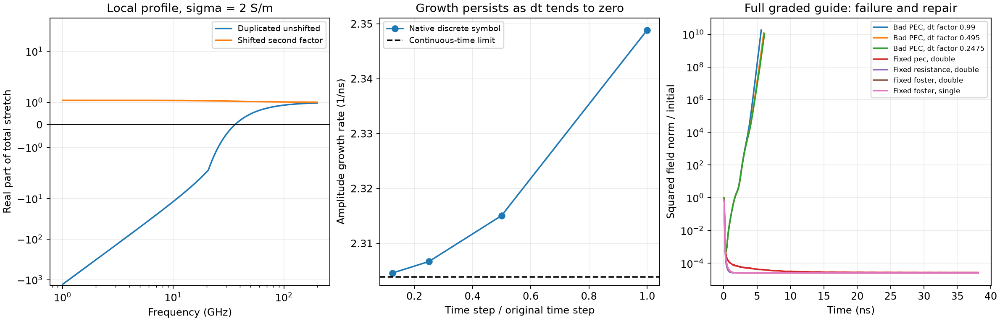

# Why the custom second-order HORIPML failed, and a tested repair

12 September 2026. The failure comes from the **product of two unshifted
stretching factors**. The resulting stretch reverses the decay of sufficiently
low-frequency evanescent components. A growing mode exists in the continuous
equations and in the native discrete update, even without SIBC. Reducing the
time step does not remove it.

The tested repair keeps the first factor unshifted and sets
**alpha2 = 1.1 sigma1 at every PML sample**, using the same spatial grading.
Four repaired full-grid runs stayed bounded for 20,000 steps. No production
kernel or user profile was automatically rewritten.



## Mechanism, derived from the implemented stretch

For the `exp(+i omega t)` convention, HORIPML multiplies its CFS factors:

$$
S(\omega)=\prod_{m=1}^2\left(\kappa_m+
            \frac{\sigma_m}{\alpha_m+i\omega\epsilon_0}\right).
$$

This product is part of the original [HORIPML formulation](https://doi.org/10.1109/TAP.2011.2180344).
The paper cautions that higher-order parameters must avoid amplification and
space contraction; its [author manuscript](https://www.researchgate.net/publication/254063081_Unsplit_Implementation_of_Higher_Order_PMLs)
gives the product in equations 4–5. The diagnosis below is independently
derived from the repository's coefficients and verified with native kernels.

For the failing profile, kappa1 = kappa2 = 1, alpha1 = alpha2 = 0, and the
two conductivity profiles are identical. With Omega = omega epsilon0,

$$
S=(1+\sigma/(i\Omega))^2
 =1-\frac{\sigma^2}{\Omega^2}-i\frac{2\sigma}{\Omega}.
$$

Thus Re(S) < 0 whenever omega < sigma/epsilon0. At a representative
sigma = 2 S/m, this covers frequencies below 35.95 GHz. The quartic profile
has sigma_max = 10.6176749192 S/m, so a substantial part of the layer has
this problem in the guide's frequency range.

A normally decaying evanescent field exp(-chi z), chi > 0, becomes
exp(-chi S z). Its magnitude grows wherever Re(S) is negative. For real
propagating waves the imaginary part still has the absorbing sign, which
explains why a short propagating pulse test can look satisfactory while
late-time fields grow. A one-dimensional normal-incidence test would miss
the transverse-mode mechanism.

This is not an instability of the isolated recursion pole: its native
factor R = (2 epsilon0 - dt sigma)/(2 epsilon0 + dt sigma) has |R| < 1.
The instability appears when the two inverse-stretch filters couple back
to Maxwell's fields. Repeated poles with suitable nonzero frequency shifts
are not inherently unstable; the zero-shift product is the problem here.

## Independent continuous and discrete checks

For a uniform local profile and a TE spatial Fourier component, the continuous
dispersion relation is

$$
s^2+c_m^2K_t^2+\frac{c_m^2K_z^2}{S(s)^2}=0,
\qquad S(s)=(1+\gamma/s)^2,\quad\gamma=\sigma/\epsilon_0,
$$

where c_m = 1/sqrt(epsilon0 mu0). Equivalently,

$$
(s^2+c_m^2K_t^2)(s+\gamma)^4+c_m^2K_z^2s^4=0.
$$

Using sigma = 2 S/m and Kt = Kz = 2 sin(pi/16)/(1 mm) produces a
right-half-plane root approximately

$$
s=2.303905790\times10^9+i\,1.160511994\times10^{11}\;\mathrm{s}^{-1}.
$$

Its amplitude doubling time is 0.301 ns. This local example demonstrates
an intrinsic growing mode; it is not a claimed eigenmode of the whole
graded, terminated guide.

The diagnostic builds the seven-state native Yee/PML amplification matrix
(Ey, eta0 Hx, eta0 Hz, and four PML histories). The matrix matches a complete
native Cython field/history step for arbitrary complex Fourier input,
checked by two real runs. Its inverse-stretch transfer also matches the
bilinear transform q = (2 epsilon0/dt)(z-1)/(z+1) to below 7e-16.

| dt / original dt | Spectral radius | Amplitude growth, 1/s |
|---:|---:|---:|
| 1 | 1.00448833 | 2.34886417e9 |
| 1/2 | 1.00220936 | 2.31507024e9 |
| 1/4 | 1.00110007 | 2.30669220e9 |
| 1/8 | 1.00054939 | 2.30460210e9 |

The per-step growth approaches one as dt decreases, but growth **per second**
converges to the positive continuous value. This rules out CFL endpoint
rounding as the explanation for this particular failure. The first-order
and repaired second-order local matrices have no growing eigenvalue beyond
floating-point tolerance; a unit eigenvalue represents a static component.

Full graded PEC-guide controls confirm the time-step result. The geometry
and initial fields were unchanged, and each run stopped after its sampled
squared field norm exceeded 1e10:

| CFL factor | Updates to stopping threshold | Physical time | Fitted late amplitude growth, 1/s |
|---:|---:|---:|---:|
| 0.99 | 2,951 | 5.626 ns | 3.77e9 |
| 0.495 | 6,301 | 6.007 ns | 3.46e9 |
| 0.2475 | 12,851 | 6.125 ns | 3.38e9 |

The whole-guide growth rate need not equal the representative uniform local
example's rate. Both independently establish persistence as dt is reduced.

## Repair condition and input recipe

Keep alpha1 = 0. For arbitrary positive kappas and nonnegative sigmas,

$$
\operatorname{Re}S
=\kappa_1\kappa_2+
\frac{\sigma_2(\kappa_1\alpha_2-\sigma_1)}
     {\alpha_2^2+(\omega\epsilon_0)^2}.
$$

Therefore **alpha2 >= sigma1/kappa1 pointwise**, with kappa1 kappa2 >= 1,
removes the negative-real-stretch mechanism at all frequencies. This is a
profile-admissibility condition for this classical/CFS pairing, not a proof
of stability for every discretized geometry or material.

For the failed kappa1 = kappa2 = 1 profile, the following replaces its two
`PMLCFS` commands. Alpha and sigma use the same conductivity units, S/m.
Explicitly specifying sigma_max ensures the two graded profiles match; alpha2
must track sigma1 at electric **and** staggered magnetic samples.

```python
import numpy as np
from scipy.constants import epsilon_0, mu_0

dl = 1e-3
eta0 = np.sqrt(mu_0 / epsilon_0)
sigma_max = 4 / (eta0 * dl)  # Quartic vacuum profile used by the reproducer.

scene.add(gprMax.PMLFormulation(formulation="HORIPML"))
for alpha_max in (0.0, 1.1 * sigma_max):
    scene.add(gprMax.PMLCFS(
        alphascalingprofile="quartic", alphascalingdirection="forward",
        alphamin=0.0, alphamax=alpha_max,
        kappascalingprofile="constant", kappascalingdirection="forward",
        kappamin=1.0, kappamax=1.0,
        sigmascalingprofile="quartic", sigmascalingdirection="forward",
        sigmamin=0.0, sigmamax=sigma_max,
    ))
```

Use these commands in place of the old profile, not in addition to it.
The numeric sigma_max above belongs to the 1 mm vacuum reproducer. For
other slab spacings/hosts choose suitable explicit sigma values and retain
the pointwise alpha2 condition; matching only the endpoint values is not
enough if polynomial orders or grading directions differ.

There is also an exact algebraic check: with identical sigmas and alpha2 =
sigma1, the product cancels to 1 + 2 sigma/(i omega epsilon0). Its native
discrete transfer matches a single factor with doubled sigma to below
3e-16. The 1.1 multiplier avoids relying on exact cancellation.

## Full-grid validation of the proposed repair

All four repaired cases ran 20,000 steps (38.131 ns), with the pulse plus
weak random E/H seeds. Fields, Foster states, and PML histories stayed finite.

| Wall model | Precision | Final squared field norm / initial |
|---|---|---:|
| Ordinary PEC | Double | 2.73105e-5 |
| 5-ohm SIBC | Double | 2.56280e-5 |
| Fitted four-pole SIBC | Double | 2.56257e-5 |
| Fitted four-pole SIBC | Single | 2.56257e-5 |

The residual contains static components of the random initial fields. These
norms are boundedness diagnostics, not a monotonic total PML/ADE energy.
In separate 600-step pulse comparisons against longer causal references,
the repaired profile's returned-wave discrepancy was 6.79e-7 for the
resistive wall and 7.33e-7 for the dispersive wall.

The practical alternatives remain the default first-order PML, or the
already tested classical/CFS second-order example profile. MRIPML is an
additive multipole formulation and does not square two unshifted factors;
its kappa normalization must be set for that formulation. The shifted
repair above specifically addresses the failing HORIPML profile.

## Reproduction and regression checks

```console
python -m testing.validation.impedance_surface.investigate_pml_profile
python -m pytest tests/pml/test_horipml_profile_stability.py -q
```

Use one OpenMP/BLAS thread. `--analytic-only` refreshes the local spectral
analysis and plot while preserving existing full-grid results. The four
regression tests passed, including native Cython field/history equivalence.
[summary.json](summary.json) and CSVs contain the measurements; ignored
`_cache/` contains geometry outputs. Production PML equations were not
changed: this fix is a deliberate choice of a physically admissible profile.
