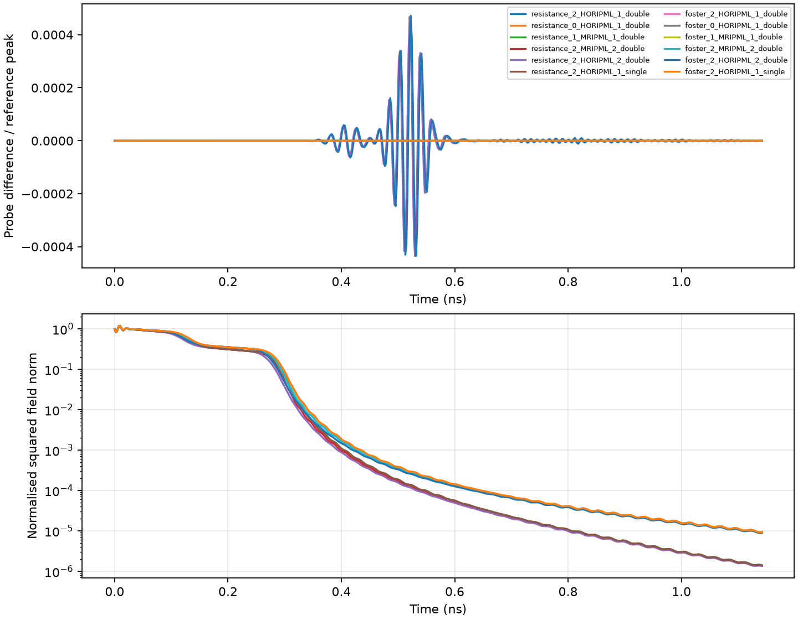
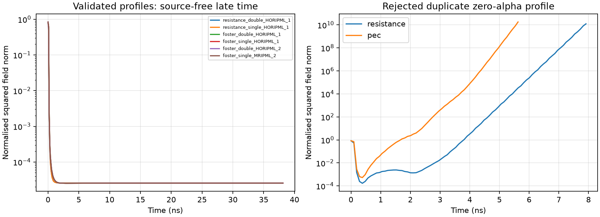

# General SIBC continued through longitudinal PML

This validation uses the native surface-impedance compiler and CPU update
sequence. It covers finite resistance and a fitted dispersive impedance with
active Foster histories. No PMC-limit adapter or substituted field equation
is used. The walls and retained vacuum are uniform along the PML absorption
direction.

Reproduce from the repository root:

```console
python -m testing.validation.impedance_surface.validate_sibc_pml
python -m testing.validation.impedance_surface.validate_sibc_pml --profile-audit-only
```

The first command writes the accepted pulse/late-time cases and an omitted
boundary-forcing control to `summary.json`. The second reproduces the rejected
custom-profile experiment in `profile_audit.json`. Raw geometry and fit plots
are ignored under `_cache/`; numerical traces and summary figures are retained.
The regression tests are `tests/impedance_surfaces/test_sibc_pml_physics.py`.

## Physical comparison

A rectangular guide has an 8 by 4 mm retained opening on a 1 mm cubic Yee
mesh, surrounded by one-cell-thick SIBC walls. A smooth TE-like initial packet
launches in both guide directions. The short domain is 120 cells long, with
16-cell PML at each end. Its otherwise identical reference is 320 cells long;
the reference's far-end physical round trip to the probe is 1.681 ns, beyond
the 1.144 ns, 600-step record. Identical initial packets and left-hand
terminations cancel in the comparison. The tiny Gaussian tail at the short
PML entrance is negligible.

The two native material declarations are:

```python
gprMax.SurfaceImpedance(id="wall", resistance=5.0)
gprMax.SurfaceImpedance(
    id="wall", conductivity=1e4,
    fit_frequency_range=(1e9, 200e9), fit_order=4, fit_tolerance=.03,
)
```

The complete fitted state-space coefficients are saved in `summary.json`.
The dispersive runs reach a surface-history amplitude of 0.008304, so the
nonzero ADE coupling is exercised. Each short guide includes 3,640 compiled
SIBC edges in PML.

There is **no explicit timestep command** in the SIBC scenes. The production
automatic cap selects `dt = 1.906574869531005e-12 s`, a factor
`0.9899999999999994` of the vacuum cubic-grid CFL limit.

All 12 packet cases pass, covering both materials, all three propagation
axes, first- and second-order HORIPML/MRIPML, and single/double precision.
The entries below are maxima over the corresponding tested cases. The
reflection measure is the peak short-minus-long probe trace divided by the
reference trace's peak; it is not a frequency-resolved S-parameter.

| PML profile | Relative returned-wave discrepancy | Final squared field norm / initial |
|---|---:|---:|
| Default first-order HORIPML/MRIPML | 4.43e-7 | 9.37e-6 |
| Two-term MRIPML, unit entrance stretch | 7.33e-7 | 9.11e-6 |
| Published two-term HORIPML profile | 4.72e-4 | 8.95e-6 |

The two-term MRIPML test uses `kappa=0.5` in each equal term, so their entrance
stretches sum to one. The two-term HORIPML test uses the existing published
profile in `testing/models_pmls/pml_3D_pec_plate/pml_3D_pec_plate.py`, including
its shifted second pole. It is not a duplicate of the first-order defaults.



## Late-time stability and a failing custom profile

The late-time test adds weak random E/H seeds to the packet to excite spatial
frequencies beyond its main band, then runs 20,000 source-free updates
(38.131 ns). Field norms, surface states, and all PML convolution histories
are checked every 50 steps and at the final step. Six cases pass: both
materials in single/double precision with the default first-order profile,
plus the Foster model with published second-order HORIPML in double precision
and second-order MRIPML in single precision. Their final normalized squared
field norms are approximately 2.563e-5. The residual includes the static
content of the random initial fields.

The plotted norm is the unweighted sum of `E^2 + eta0^2 H^2`, including PML.
It is a boundedness/decay diagnostic, not the exact clipped-cell plus ADE
energy, and it need not decrease monotonically during a leapfrog step.

**A custom PML profile did fail.** Simply duplicating the unshifted
first-order HORIPML factor (`alpha=0`, `kappa=1`, default quartic sigma) twice
produced growing late-time fields. The same profile was then tested with
ordinary PEC guide walls, at the same 0.99 timestep factor:

| Wall | Updates before stopping | Time | Squared norm / initial |
|---|---:|---:|---:|
| Finite 5 ohm SIBC | 4,151 | 7.914 ns | 1.23e10 |
| Ordinary PEC | 2,951 | 5.626 ns | 1.78e10 |

These diagnostic runs stop when the sampled norm exceeds 1e10, rather than
continuing to overflow. This failure also occurs without SIBC and therefore
does not originate in the new sparse PML coupling. The automatic 0.99 SIBC
cap does not make an unsuitable custom PML profile stable. The failed
profile and complete growth traces are retained in `profile_audit.json` and
`duplicated_unshifted_*.csv`; they are separate from the accepted profiles.



## Sensitivity to the boundary PML correction

A diagnostic run retains the native PML convolution updates but deliberately
discards their forcing on sparse SIBC electric edges. At 5 ohm, the wall's
tangential electric field is small, making a probe trace relatively
insensitive to this omission. A finite `resistance=1e6` control makes the
boundary electric field appreciable: the relative returned-wave discrepancy
increases from 1.645e-4 to 2.004e-3, a factor of 12.18. Both traces and the
reference are retained in `omitted_pml_control.csv`. The diagnostic requires
an omitted-correction discrepancy above 1e-3 and more than five times its
correctly coupled baseline.

These tests support the uniformly extruded, isotropic lossless retained-host
case. They do not establish stability for every user-selected PML profile,
active impedance, normal-to-surface stretch, or longitudinally varying wall.
