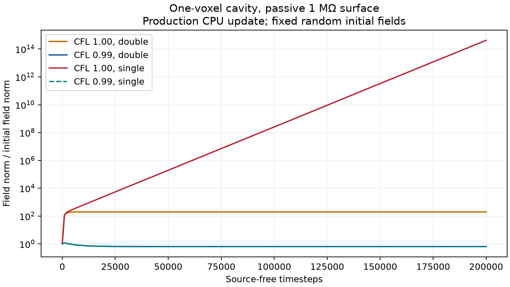

# Clipped-circulation surface-impedance stability audit

11 September 2026. Checkout: `my-devel-11`, `977780ce`.

**Historical audit:** the endpoint results here predate the automatic SIBC
timestep margin. The current implementation caps the existing stability
factor at 0.99 whenever SIBC is declared, preserves smaller user factors, and
logs automatic reductions. See the [protected full-solver verification](default_cfl_report.md)
for the successful 200,000-step reruns. `--historical` reproduces the endpoint
measurements below through a validation-only bypass.

Follow-up: [the default-timestep audit](default_cfl_report.md) verifies the
unmodified production solver, quantifies the actual binary rounding, and
explains the single-precision growth using the stored coefficient matrix.

The clipped circulation is energy consistent for the tested voxel geometries,
and it does **not require a smaller geometric CFL bound** in a homogeneous,
nondispersive exterior. However, **running at the CFL endpoint is not robust
for every supported passive surface**. A one-voxel cavity with a 1 MΩ resistive
surface developed severe growth in single precision at the former default timestep.
Using 0.99 of the Cartesian CFL timestep removes that observed growth.

This is a conditional stability result, not a claim that every surface model,
material contact, and solver configuration is stable.

## Upstream status and compatibility fix

`git fetch upstream --prune` completed against
`https://github.com/gprMax/gprMax.git`. The latest development tip was
`230bf6eb` (11 September, “Merge pull request #832…”). It is already an
ancestor of this checkout: `HEAD...upstream/devel` reports **3 ahead, 0 behind**.
The reflog confirms an earlier rebase onto this exact commit. No further
rebase or history rewrite was needed. `upstream/master` is a separate release
history, not this branch's development base. Nothing was pushed.

The existing test suite exposed an integration regression from upstream
`9a1447d7`: directional cell records now have type `anisotropic`, whereas the
impedance compiler's unsupported directional PEC/PMC check only recognized
`dielectric-smoothed`. Two existing tests consequently failed to raise the
required error. The check now recognizes both representations. This restores
the existing supported-geometry contract. This compatibility fix leaves the
field-update equations unchanged; the subsequent timestep policy is described above.

## What is actually clipped

`compile_impedance_surfaces()` in `gprMax/impedance_surfaces.py` clips the **H
circulation used by the E/Ampère update**. Retained H components still execute
the ordinary Faraday update in `gprMax/cython/fields_updates_normal.pyx`.
The sparse E update and surface histories execute in
`gprMax/cython/impedance_surface.pyx` after the ordinary electric updates.

The retained electric dual-area fractions are ¼, ½, and ¾. A retained voxel
contributes one quarter of its volume to each incident electric edge and one
half to each magnetic face. Hence a magnetic face at the impedance interface
has **half magnetic energy weight**, even though its Faraday stencil is
unchanged. Using a full-cell magnetic energy there would incorrectly suggest
that the clipped electric stencil breaks reciprocity.

The small-irregular-cell issue raised by the project manager is established
for conformal FDTD, where continuously varying cut areas can shrink without
bound. See [Kuo and Kuo, 2010](https://www.ee.nsysu.edu.tw/uploadPDF/PDF/P4162002884318.pdf).
This implementation instead assembles whole retained voxel quadrants. The
relevant test is the weighted relation between both curl operators, not the
presence of a clipped integral alone. The algebraic energy approach is also
central to [Clemens and Weiland's FIT formulation](https://www.jpier.org/PIER/pier.php?paper=00080103).

## Energy and timestep analysis

For the vacuum exterior used here, write `h = eta0 H`. Let `We` and `Wh` be
diagonal retained-volume fractions. The source-free, unloaded update is

\[
h^{n+1/2}=h^{n-1/2}+Qe^n,\qquad
e^{n+1}=e^n+Rh^{n+1/2}.
\]

The compiler must satisfy

\[
W_eR=-Q^T W_h.
\]

The audit constructs `We, Wh` independently by visiting retained voxels and
measures `Q, R` by applying the **production Cython kernels** to basis fields.
It temporarily opens the surface load to isolate the geometric coupling;
the clipped weights and retained masses remain intact. For double precision,
the relative adjoint defect is below **3.3 × 10⁻¹⁶** in the recorded cases.
For single precision it is approximately **10⁻⁷**.

Up to the common positive factor `epsilon0 * voxel_volume`, the modified
leapfrog energy is

\[
\mathcal E^n=\frac12(e^n)^T W_e e^n+
\frac12(h^{n-1/2})^T W_h h^{n+1/2}.
\]

It is positive definite when

\[
\sigma_{\max}(W_h^{1/2}QW_e^{-1/2})<2.
\]

For a single rectangular retained voxel, the largest squared singular value
of its spatial curl with these mass weights is
`4*(1/dx² + 1/dy² + 1/dz²)`. Summing this local quadratic-form bound over all
retained voxels gives the same bound globally. Setting constrained PEC E
components to zero only restricts the admissible fields. Thus a sufficient
strict bound in a uniform medium is

\[
\Delta t < \frac{1}{c\sqrt{\Delta x^{-2}+\Delta y^{-2}+\Delta z^{-2}}}.
\]

The quarter-cell masses do not introduce an additional factor of two or four
in this bound. A one-voxel retained cavity **attains** the Cartesian bound,
so equality needs separate treatment.

A positive resistive surface dissipates
`dt * sum(port_area/R * E_midpoint²)`. A regression test verifies the complete
matrix energy identity, including that loss, to absolute error below
`2e-13`. A passive trapezoidal surface realization also has its own stored
energy; the complete amplification matrices include its ADE states. The
plotted field energy alone is not the total energy for the copper cases.

## Experiments and observations

The test domain has 5 × 5 × 5 cells, a PEC exterior boundary, no PML, and no
source. Initial E and impedance-normalized H are fixed-seed random fields;
surface histories initially vanish. This excites high spatial frequencies
that a smooth pulse can miss. It also excites static modes, so residual
energy and unit eigenvalues are expected and do not imply instability.

The sweep covers a single-voxel obstacle, an L-shaped staircase, a thin plate,
a hollow 3 × 3 × 3 shell containing one retained voxel, rectangular cells
with a 4:1 spacing ratio, resistance from 0.001 Ω to 1 MΩ, a four-pole copper
fit over 1–20 GHz, and both CPU precisions. Complete matrices contain
618–1290 active field/history unknowns. Ordinary cases run for 20,000 steps;
the high-resistance cavity comparisons and single-precision copper cavity
run for 200,000 steps.

Selected measured results (field norm means `||(E, eta0 H)|| / initial_norm`):

| Geometry / surface | CFL factor | Precision | Steps | Peak field norm ratio | Observation |
| --- | ---: | --- | ---: | ---: | --- |
| Staircase, 50 Ω | 0.99 | double | 20,000 | 1.07 | Bounded; dissipative energy identity holds |
| Staircase, copper ADE | 1.00 | double | 20,000 | 1.27* | No growing spectral mode observed |
| One-voxel cavity, copper ADE | 1.00 | single | 200,000 | 1.11* | Bounded in this run |
| One-voxel cavity, 1 MΩ | 1.00 | double | 200,000 | 198 | Large finite amplification |
| One-voxel cavity, 1 MΩ | 1.00 | single | 200,000 | 4.23 × 10¹⁴ | Severe late-time growth |
| One-voxel cavity, 1 MΩ | 0.99 | double | 200,000 | 1.43 | Bounded |
| One-voxel cavity, 1 MΩ | 0.99 | single | 200,000 | 1.43 | Bounded |
| Above-CFL staircase control, 50 Ω | 1.20 | double | 100 | 7.01 × 10³⁸ | Instability detected; spectral radius 2.493 |

\* Copper ratios include the stored `y` coordinates in the Euclidean norm;
they are descriptive state amplitudes, not a physical energy norm.



For the double-precision cavity at CFL = 1, the normalized positive-energy
margin `1 - sigma_max/2` is only **6 × 10⁻¹³**, versus **0.01** at CFL = 0.99.
The actual scalar timestep lies only `3.33e-16` below the c-based CFL;
most of the `6e-13` operator margin comes from the stored electromagnetic
constants. Both margins are much smaller than single-precision coefficient
errors. The follow-up coefficient audit identifies a rounded-coefficient
spectral radius of `1.00014346`, closely matching the actual growth.

The initial basis-probed spectral diagnostic misses this failure. Basis probes
approximate a linear map, whereas single-precision arithmetic is not exactly linear. Perturbations
near a multiple unit-circle mode and severe transient amplification require
actual long-time stepping as well. The single-precision basis-probed matrix
reports a radius near `1 + 3.2e-8`, even for the case whose actual field norm
grows by fourteen orders of magnitude.

## Practical action and scope

The clipped formulation is retained for the supported voxel geometry. SIBC
declarations now automatically apply a strict CFL margin through the existing
command. The tested setting, which may also be given explicitly, is:

```python
scene.add(gprMax.TimeStepStabilityFactor(f=0.99))
```

Equivalent input-file command:

```text
#time_step_stability_factor: 0.99
```

This setting is a demonstrated remedy for the reproducer, not a universal
guarantee for dispersive bulk materials or other coupled algorithms. The cap
is documented in the impedance-surface guide and both command references.
Smaller user factors are preserved, without multiplying them by 0.99 again.

The proof and new spectral sweep cover a homogeneous nondispersive exterior,
passive surfaces, interior voxel bodies, and a PEC outer box. They do not
certify arbitrary anisotropic or heterogeneous constitutive averaging,
dispersive bulk ADEs, PML, symmetry contacts, or source/port coupling. The
existing impedance test suite exercises several of those combinations, but
its finite-duration checks are not a global stability proof.

## Reproduction

At the time of this historical audit, **447 impedance-surface tests passed**, including the
11 new stability tests and the two restored directional-contact checks.
The full scientific sweep contains 19 cases. The intentionally unstable
above-CFL control and the documented single-precision endpoint reproducer
are diagnostic results, not cases silently classified as stable.

```text
python -m testing.validation.impedance_surface.stability --historical --steps 20000
python -m pytest tests/impedance_surfaces -q
```

With `--historical`, the validator writes [raw results](results/stability.json)
and the plot above. Without it, the automatic cap remains active and outputs
are written separately as `stability_protected.json` and `.png`.
`--quick` runs the staircase and above-CFL control only. Peak norms and energy
changes are sampled every 20 steps; plot traces are decimated further. The
above-CFL override is local to the validation builder and is not a supported
simulation setting.

This Windows checkout was built using the existing `gprMax2` environment,
Python 3.13, NumPy 2.5.2, SciPy 1.18.1, and MSVC with OpenMP. Cython generation
was run serially to avoid a Windows multiprocessing bootstrap failure in
`setup.py`; extensions were then built normally. Pytest temporary output was
placed under `.codex_tmp` because the sandbox could not access the default
user pytest directory. Runtime version details are also saved in the JSON.
