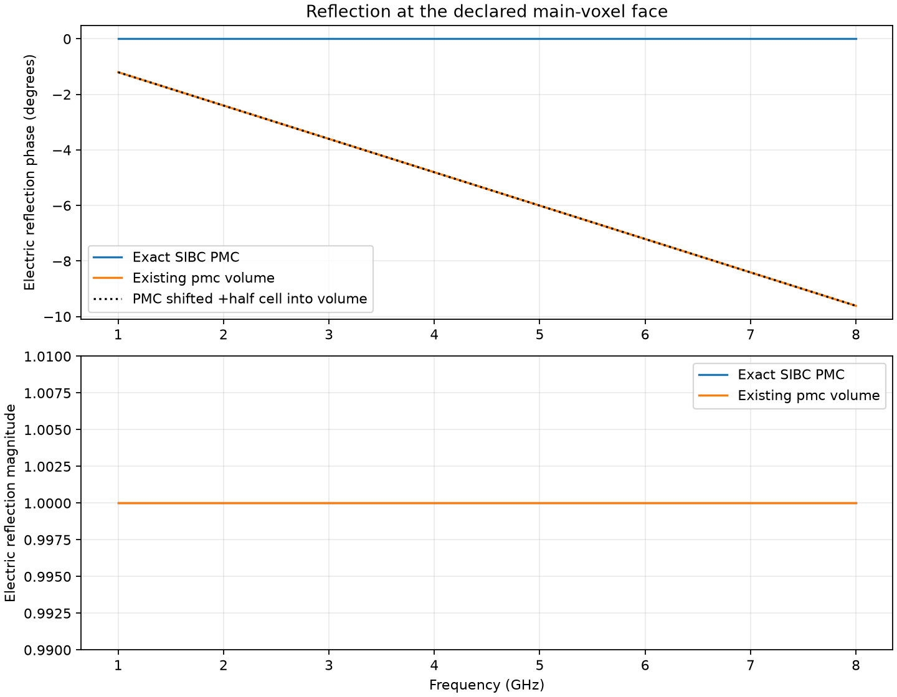
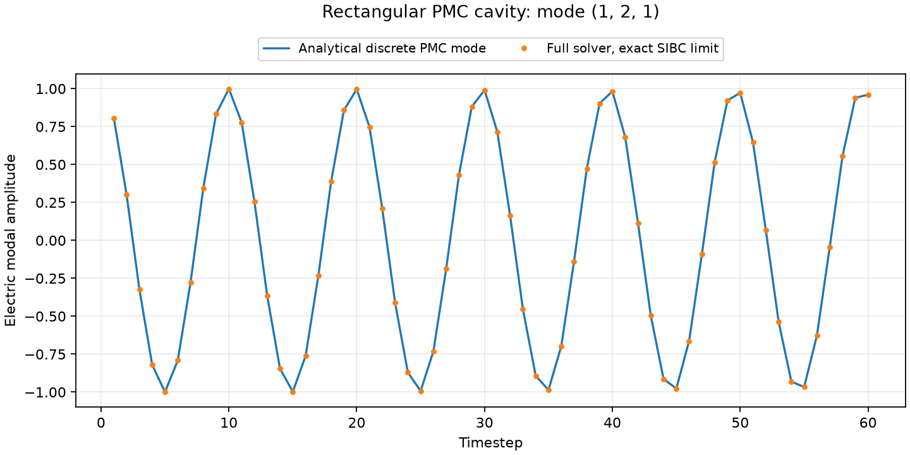
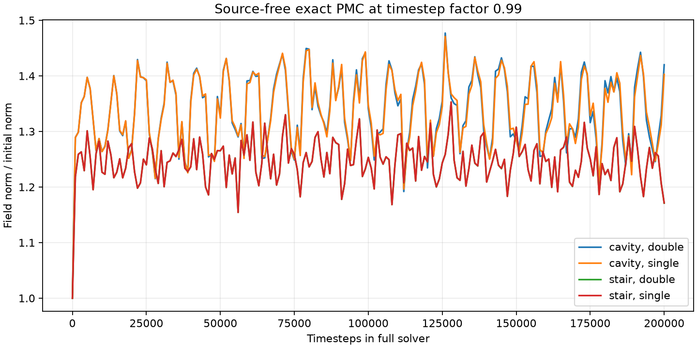

# PMC at a main-voxel face from the exact SIBC limit

12 September 2026. Source base: `977780ce`, with the local clipped-SIBC and
automatic 0.99 timestep-margin changes. CPU Cython kernels, Python 3.13,
one OpenMP thread. Both field precisions were checked.

**The exact zero-admittance limit of the current clipped SIBC gives a PMC
at the declared voxel face in these tests.** It matches the independent 3D
mirror construction, reflects with electric coefficient +1 at that face,
and supports the correct discrete rectangular-cavity modes. The existing
`material_id="pmc"` volume reflects a normally incident wave as if its face
were **half a cell inside the volume**. This is a placement error when the
intended PMC lies on the main-voxel face.

The public constructor now accepts
`SurfaceImpedance(id="wall", resistance=float("inf"))`, also available as
`#surface_impedance: wall resistance inf`. The original tests below retain
their `runtime.py` adapter for reproducing the initial derivation. The
production option uses the same exact zero-admittance limit and leaves the
built-in `pmc` volume material unchanged.

Using legacy PMC volume geometry now emits a warning recommending infinite
SIBC resistance. Internal TE constraints and PMC symmetry boundaries do not
trigger it. All reduced TE/TM orientations and CPU virtual guides are covered
by the [2D PMC validation](2d_validation.md).

Uniform longitudinal PML continuation is now implemented for **general
passive SIBC**, including finite resistance, fitted Foster models, and PMC.
The [native PMC/PML comparisons](pml_mirror.md) cover both formulations,
orders, and field precisions. General finite/dispersive PML and virtual-guide
results are recorded in
[`../impedance_surface`](../impedance_surface/README.rst).

## Exact update equation

### Boundary condition and the infinite-impedance limit

Let the unit normal point from the excluded volume into the retained domain.
Write the surface law using admittance:

$$
\mathbf K=\mathbf n\times\mathbf H
    =Y_s\mathbf E_t,\qquad Y_s=1/Z_s.
$$

For finite tangential electric field, taking the **constant resistive** limit
$Z_s\to+\infty$ gives exactly

$$
Y_s=0,\qquad \mathbf K=0,\qquad \mathbf n\times\mathbf H=0.
$$

This is the PMC condition. The excluded volume does not contain fields; its
boundary permits tangential E and normal H. This interpretation of a PMC as
zero tangential H on the boundary of an excluded high-impedance region is
also described in the [COMSOL reference](https://doc.comsol.com/6.3/doc/com.comsol.help.rf/rf_ug_radio_frequency.07.013.html).
It is not obtained by forcing every retained H component to zero.

This limit is an open surface-current port. It is **not** an infinitely large
finite resistance approximation, and no surface ADE state is required.

### General clipped edge, including corners

Consider an electric edge in direction $a$, with transverse directions
$b,c$. Its retained dual area consists of voxel quadrants $q$, each with
area $A_q=\Delta b\Delta c/4$. Define

$$
M_\epsilon=\sum_{q\in\mathrm{retained}}\epsilon_q A_q,\qquad
M_\sigma=\sum_{q\in\mathrm{retained}}\sigma_q A_q,
$$

$$
C_H^{n+1/2}=\sum_\ell w_\ell H_\ell^{n+1/2},\qquad
G_s=\sum_p\ell_p Y_{s,p}.
$$

Here $w_\ell$ are the signed retained lengths of the H circulation and
$\ell_p$ are the lengths of its boundary segments. The existing compiler
assembles these lengths by summing the two half-segments contributed by
each retained voxel quadrant. For a nondispersive host and constant
resistive surface, its discrete Ampère equation is

$$
M_\epsilon\frac{E^{n+1}-E^n}{\Delta t}
+M_\sigma\frac{E^{n+1}+E^n}{2}
=C_H^{n+1/2}-G_s\frac{E^{n+1}+E^n}{2}.
$$

Therefore the finite-load update is

$$
E^{n+1}=
\frac{\left(M_\epsilon/\Delta t-M_\sigma/2-G_s/2\right)E^n
      +C_H^{n+1/2}}
     {M_\epsilon/\Delta t+M_\sigma/2+G_s/2}.
$$

For a PMC, **set $G_s=0$ exactly**:

$$
\boxed{E^{n+1}=
\frac{\left(M_\epsilon/\Delta t-M_\sigma/2\right)E^n+C_H^{n+1/2}}
     {M_\epsilon/\Delta t+M_\sigma/2}.}
$$

In a lossless uniform exterior, this reduces to

$$
\boxed{E^{n+1}=E^n+
  \frac{\Delta t}{\epsilon A_{\mathrm{retained}}}
  \sum_\ell w_\ell H_\ell^{n+1/2}.}
$$

The retained area remains one, two, or three quarters of the full dual
area. **Removing the surface load does not restore the full-cell electric
mass or the omitted H segments.** Those geometric terms place the PMC at
the voxel face and give the correct edge/corner update.

For dispersive exterior material, only the surface terms disappear. In the
compiler's notation the corresponding equation is

$$
E^{n+1}=\frac{a_- E^n+C_H^{n+1/2}-\Phi^n}{a_+},\qquad
\Phi^n=\sum_m\operatorname{Re}(c_m S_m^n),
$$

with the existing bulk-polarization corrections in $a_\pm$ and unchanged
bulk histories $S_m^{n+1}=f_mS_m^n+b_m(E^n-E^{n+1})$.
The new numerical results below concern nondispersive exterior material;
this algebraic extension has not been validated here for bulk dispersion.

### Flat face: the required factor of two

For retained space $x<x_w$, a flat PMC at $x_w=i\Delta x$, a lossless
uniform host, and no source on the boundary, the explicit tangential updates
are

$$
E_z^{n+1}(i,j,k+\tfrac12)=E_z^n(i,j,k+\tfrac12)
+\frac{\Delta t}{\epsilon}
\left[-\frac{2H_y^{n+1/2}(i-\tfrac12,j,k+\tfrac12)}{\Delta x}
-\frac{H_x^{n+1/2}(i,j+\tfrac12,k+\tfrac12)
       -H_x^{n+1/2}(i,j-\tfrac12,k+\tfrac12)}{\Delta y}\right],
$$

$$
E_y^{n+1}(i,j+\tfrac12,k)=E_y^n(i,j+\tfrac12,k)
+\frac{\Delta t}{\epsilon}
\left[\frac{2H_z^{n+1/2}(i-\tfrac12,j+\tfrac12,k)}{\Delta x}
+\frac{H_x^{n+1/2}(i,j+\tfrac12,k+\tfrac12)
       -H_x^{n+1/2}(i,j+\tfrac12,k-\tfrac12)}{\Delta z}\right].
$$

The normal-direction factor of two comes from the half dual area and
$H_t(x_w)=0$. It is identical to an odd ghost value across the wall:
$H_t(x_w+\Delta x/2)=-H_t(x_w-\Delta x/2)$.
The neighboring H sample is **half a cell away** and generally is not zero.
The derivative along the wall retains its ordinary coefficient.

The other faces follow by cyclic permutation and changing the outward
side. At a convex corner with one retained quadrant, both half-segment
weights and the quarter-area mass enter the general formula above.

Retained H uses the ordinary Faraday update. In particular, the normal H
sample on the physical face stays active and uses the tangential E curl.
The excluded interior fields remain void. Normal E is staggered off the
face; its odd mirror continuation gives zero normal displacement on the
face for compatible initial data. The mirror parities are:

| Component | Parity across the PMC face |
| --- | --- |
| Tangential E | Even |
| Normal E | Odd |
| Tangential H | Odd |
| Normal H | Even |

### Mapping to the existing runtime

The compiler stores `port_g = -length`, so its `metric_admittance` is
$-G_s$. The exact PMC compilation has:

```python
port_inv_Z0[:] = 0
port_g_over_Z0[:] = 0
# With no bulk dispersion:
edge_runtime[:, 0] = M_epsilon / dt - M_sigma / 2
edge_runtime[:, 1] = 1 / (M_epsilon / dt + M_sigma / 2)
```

The adapter in [runtime.py](runtime.py) replaces the discrete feedthrough
with positive infinity **before** the compiler computes its reciprocals.
IEEE `1 / +inf` then gives exact zero; infinity is never multiplied into the
field update. Assertions verify zero admittances, zero surface-state counts,
and finite electric-update coefficients. The unmodified compiler supplies
all retained areas, H weights, void IDs, and boundary E holds, and the
unmodified Cython kernel executes the update. The context manager restores
the normal discretization afterward; finite-resistance control runs use it.

The finite `resistance=50` declaration is solely a geometry placeholder in
exact-PMC cases. It is **not** the simulated impedance. Raw HDF5 files in
`_cache` retain that placeholder material definition; they cannot reproduce
the run without this adapter. [summary.json](results/summary.json) explicitly
records the exact-limit override.

## Validation results

All acceptance checks passed. Plots and CSV data are in [results](results/).
The 12 focused pytest cases also passed.

### 1. Independent 3D mirror comparison

A full vacuum grid is initialized using the parity table above. A separate
SIBC grid retains only one side of the face. Random initial values vary in
all three dimensions, so the comparison exercises both polarizations and
variation along the face. It compares **all six retained field components**
after each of 200 updates. The reference contains no SIBC or PMC material.
Cell spacings are 1, 1.3, and 1.7 mm; all three face orientations are tested.
This is a discrete operator check; arbitrary random initial data need not
satisfy the source-free Gauss constraints. The cavity modes below do.

| Precision | Maximum field error / initial field norm, over all orientations | Acceptance limit |
| --- | ---: | ---: |
| Double | 6.47e-15 | 2e-12 |
| Single | 5.04e-6 | 2e-5 |

This tests the location, signs, factor of two, along-face derivatives, and
the retained normal-H update independently of the SIBC's surface law.

### 2. Reflection phase, both polarizations, and wall location

Full `gprMax.run()` simulations use a uniform TEM current sheet, a 1 mm
mesh, a 4 ns record, and a 1–8 GHz analysis band. The source, receiver, and
wall are at 0.80, 0.86, and 0.89 m along propagation. Transverse PEC/PMC
symmetry makes the wave uniform. Outer-boundary returns arrive after the
measurement window; PML is disabled. Identical no-wall references supply
the incident wave. Reflection is de-embedded by 30 mm using the exact
discrete vacuum wavenumber computed from the stored epsilon/mu constants.

All three axes and both tangential E polarizations are checked, plus reverse
propagation in x: seven configurations per boundary type. Every exact-limit
case gives the same result to the reported precision:

| Boundary | Maximum $|\Gamma_E-1|$ | Maximum phase error | Fitted displacement along propagation |
| --- | ---: | ---: | ---: |
| Exact SIBC PMC | 2.19e-10 | 1.05e-8 degrees | 5.55e-14 m |
| Existing `pmc` volume | 0.1676 | 9.614 degrees | **+0.500000 mm** |

The exact PMC target is $\Gamma_E=+1$; equivalently
$\Gamma_H=-1$ for a normally incident plane wave. Both boundary models
block transmission: the monitored field behind the four-cell-thick volume
is identically zero in these source-free shadow regions.

With the $e^{+j\omega t}$ convention, the legacy result follows
$\Gamma_E=e^{-jk_x\Delta x}$, exactly the phase of a PMC displaced
$+\Delta x/2$ inside the volume. A magnitude-only comparison would miss
this error. At normal incidence the legacy full-cell E update adjacent to
the first clamped H sample places the zero-H plane at that sample, instead
of using the half dual-cell update at the declared voxel face. This result
concerns **voxel `pmc` volumes**, not the separate `SymmetryBoundary` command.



The finite-R controls also approach the exact PMC limit. The independent
discrete planar reference is

$$
\Gamma_E(R)=\frac{R\cos(k_x\Delta x/2)-\eta\cos(\omega\Delta t/2)}
                  {R\cos(k_x\Delta x/2)+\eta\cos(\omega\Delta t/2)}.
$$

| Resistance | Maximum distance from PMC, $|\Gamma_E-1|$ |
| --- | ---: |
| 1 kΩ | 0.5482 |
| 100 kΩ | 0.007524 |
| 10 MΩ | 7.553e-5 |

All three controls agree with this finite-R formula within 2.2e-10 complex
error. They demonstrate convergence; the exact-PMC tests do not use them
as a numerical substitute for infinity.

### 3. Closed PMC cavity, including edges and corners

A retained 6 × 7 × 8-cell rectangular cavity has a one-voxel SIBC shell
and 1, 1.3, 1.7 mm spacings. Analytic PMC standing waves initialize the
fields with discrete divergence-free polarization and correctly staggered
magnetic time. The complete solver advances 2,000 steps. Every E/H value,
including the exterior zeros, is compared with the discrete analytic mode.

For indices $(m_x,m_y,m_z)$, lengths $L_a=N_a\Delta a$, and
$v=1/\sqrt{\epsilon\mu}$, the reference frequency is

$$
\omega_d=\frac{2}{\Delta t}\sin^{-1}\left[
 v\Delta t\sqrt{\sum_a
   \frac{\sin^2(m_a\pi/(2N_a))}{\Delta a^2}}\right].
$$

For example, the electric modal shapes have the form
$E_x=A_x\sin(k_xx)\cos(k_yy)\cos(k_zz)$ and cyclic permutations,
with $\sum_a\widetilde{k}_a A_a=0$,
$\widetilde{k}_a=2\sin(k_a\Delta a/2)/\Delta a$.
This includes nonzero normal H at PMC faces. The continuum frequencies
are not used as exact FDTD targets because of Yee dispersion.

| Mode | Precision | Discrete frequency | Continuum frequency | Maximum normalized all-field error |
| --- | --- | ---: | ---: | ---: |
| (1, 1, 0) | Double | 29.856798 GHz | 29.924339 GHz | 1.77e-13 |
| (1, 2, 1) | Double | 42.470620 GHz | 42.789453 GHz | 1.66e-13 |
| (2, 1, 2) | Double | 56.468485 GHz | 57.042014 GHz | 1.41e-13 |
| (1, 2, 1) | Single | 42.470620 GHz | 42.789453 GHz | 1.80e-5 |

Acceptance limits are 2e-11 in double and 2e-4 in single precision. The norm
uses E and impedance-normalized H and includes both temporal quadratures.



### 4. Long-time behavior and energy

The automatic timestep factor remains **0.99**. Four full-solver runs use
random initial fields and no source, with **200,000 steps each**: a single
retained voxel inside a closed PMC shell, and an L-shaped PMC obstacle,
each in single and double precision. The surrounding 5 × 5 × 5 grid has a
PEC outer boundary. All runs stay bounded over the tested duration.

| Geometry | Precision | Peak sampled field-norm ratio | Relative modified-energy change after 20,000 steps |
| --- | --- | ---: | ---: |
| One-voxel cavity | Double | 1.5094 | −4.08e-13 |
| One-voxel cavity | Single | 1.5085 | −7.06e-5 |
| L-shaped obstacle | Double | 1.3625 | −1.35e-13 |
| L-shaped obstacle | Single | 1.3627 | +2.56e-5 |

Norm peaks are sampled every 20 steps; the exported full-solver traces are
sampled every 1,000 steps. The field norm need not be constant: the lossless
leapfrog invariant includes a mixed-time magnetic term. The separate
20,000-step kernel runs measure that modified energy with quarter-volume
E weights and half-volume H weights at the boundary. In exact arithmetic,

$$
\mathcal E^n=\tfrac12(e^n)^TW_e e^n+
\tfrac12(h^{n-1/2})^TW_h h^{n+1/2},\qquad h=\eta H,
$$

is conserved when $W_eR=-Q^TW_h$. The matrix regression checks this
identity to 2e-13. The random runs give weighted adjoint defects below
2e-16 in double precision and about 1e-7 in single precision. The largest
dimensionless frequency is 1.98 for the one-voxel cavity, below the
leapfrog limit 2. The ordinary Cartesian CFL bound and the previous strict
margin therefore remain appropriate to this tested homogeneous problem.

Single-precision coefficients cause small energy drift even with exactly
zero surface admittance. Thus the result is bounded behavior for the tested
durations, not an assertion of exact floating-point conservation or an
unlimited-duration stability proof.



## Reproduction and scope

From the repository root, using the built CPU extensions:

```text
python -m testing.validation.sibc_based_pmc.validate
python -m pytest tests/impedance_surfaces/test_sibc_based_pmc.py -q
```

`--steps` controls the four long runs; the default is 200000. `--output-dir`
selects a different report directory. The default writes `results/summary.json`,
the per-case CSV files, and three PNG figures. Raw solver files stay under
the ignored `_cache` directory. No saved receiver data are silently reused.

The evidence supports a **main-voxel-aligned, opaque PMC boundary** for the
tested manifold voxel geometries and nondispersive CPU configurations.
The existing topology checks still apply. This does not validate a smooth
conformal surface, transmissive zero-thickness sheet, arbitrary bulk
dispersion/anisotropy, general PMC/source contact, or GPU/MPI/subgrid
execution. PML and virtual-guide integration are covered by the separate
production-extension tests linked above, with the documented restrictions
on uniform extrusion, retained host, and aperture padding.
